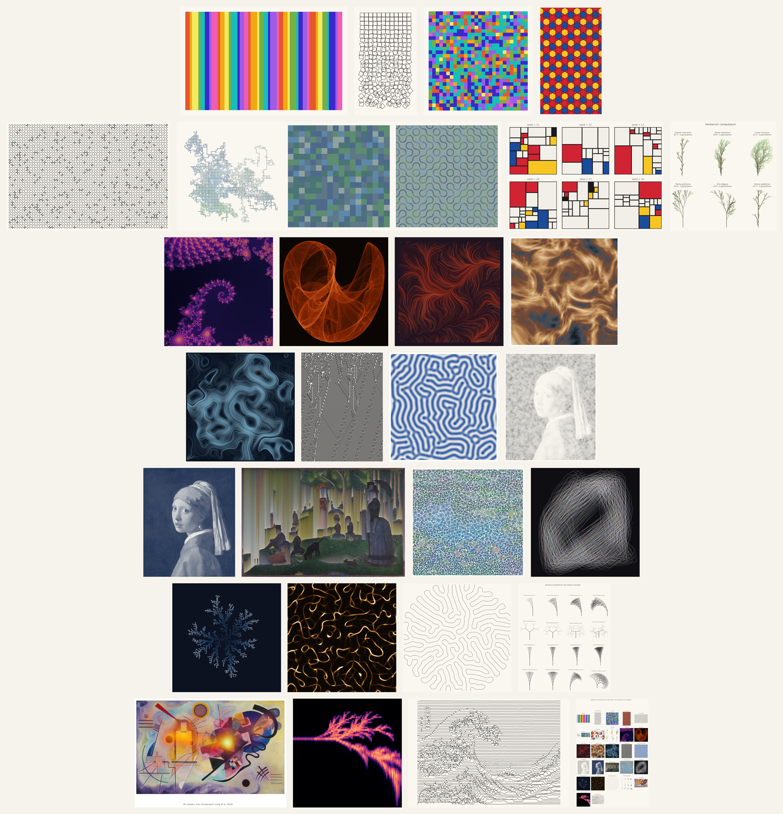

# Algorithmic Generative Art with Python

**A hands-on book teaching mathematics and Python through the making of generative art, written for art history students.**



## Chapters

### Prelude

| Ch. | Title | Core method | Art anchor |
|----:|-------|-------------|------------|
| 0 | [Warming Up: Python and Mathematics from Zero](notebooks/00-warming-up.ipynb) | Python basics, notation, first matplotlib | stripe painting: Stella, Davis, Riley, Buren |

### Part I · Foundations

| Ch. | Title | Core method | Art anchor |
|----:|-------|-------------|------------|
| 1 | [Random Walks: The First Generative System](notebooks/01-random-walks.ipynb) | loops, randomness, plotting | Sol LeWitt, Georg Nees *Schotter*, Vera Molnár |
| 2 | [Chance Operations and Controlled Randomness](notebooks/02-chance-and-randomness.ipynb) | distributions, seeding, weighted choice | Arp, Duchamp, Cage, Kelly, Richter |
| 3 | [Geometric Patterns and Symmetry](notebooks/03-geometric-patterns.ipynb) | trigonometry, rotation, tiling | Alhambra, girih tiles, Owen Jones, Escher |
| 4 | [Recursion and Subdivision](notebooks/04-recursion-and-subdivision.ipynb) | recursive functions | Mondrian, De Stijl |
| 5 | [Color: Spaces, Palettes, Extraction](notebooks/05-color.ipynb) | RGB/HSV/LAB, k-means | Itten, Albers, Rothko |

### Part II · Natural Form and Emergence

| Ch. | Title | Core method | Art anchor |
|----:|-------|-------------|------------|
| 6 | [L-Systems and Botanical Form](notebooks/06-l-systems.ipynb) | string rewriting, turtle graphics | Merian, Besler, Haeckel, D'Arcy Thompson |
| 7 | [Fractals: Infinite Detail](notebooks/07-fractals.ipynb) | complex iteration, escape time | Mandelbrot, Hokusai, the Pollock controversy |
| 8 | [Noise and Flow Fields](notebooks/08-noise-and-flow-fields.ipynb) | coherent noise, vector fields | Perlin, Tyler Hobbs *Fidenza* |
| 9 | [Cellular Automata and Emergence](notebooks/09-cellular-automata.ipynb) | rule tables, Game of Life | Jacquard loom, Anni Albers, Conway |
| 10 | [Reaction-Diffusion: Turing Patterns](notebooks/10-reaction-diffusion.ipynb) | Gray-Scott model | Turing 1952, Morris, Jugendstil ornament |

### Part III · The Image, Transformed

| Ch. | Title | Core method | Art anchor |
|----:|-------|-------------|------------|
| 11 | [Voronoi, Delaunay, and Stippling](notebooks/11-voronoi-and-stippling.ipynb) | tessellation, Lloyd relaxation | Seurat, mosaic, Secord stippling |
| 12 | [Filters, Edges, and Dithering](notebooks/12-filters-and-dithering.ipynb) | convolution, Gabor, Floyd-Steinberg | Lichtenstein, halftone, glitch |
| 13 | [Pixel Sorting: The Aesthetics of the Glitch](notebooks/13-pixel-sorting.ipynb) | sorting, masks, interval detection | Paik, Menkman, Asendorf |
| 14 | [Circle Packing: The Portrait in Dots](notebooks/14-circle-packing.ipynb) | collision tests, greedy growth | Kandinsky, Kusama, the Apollonian gasket |

### Part IV · Agents and Complexity

| Ch. | Title | Core method | Art anchor |
|----:|-------|-------------|------------|
| 15 | [Particles, Agents, and Flocking](notebooks/15-particles-and-flocking.ipynb) | Boids, simulation | Calder, Riley, teamLab, Reynolds 1987 |
| 16 | [Aggregation: Growth by Random Walk](notebooks/16-diffusion-limited-aggregation.ipynb) | diffusion-limited aggregation | Bentley, Lichtenberg figures, Witten & Sander |
| 17 | [Physarum: The Trail-Laying Swarm](notebooks/17-physarum.ipynb) | agents coupled to a field | slime mold, Tero, Barnett, Jenson |
| 18 | [Evolving Images: Breeding as Composition](notebooks/18-evolving-images.ipynb) | mutation, selection by eye | Dawkins, Latham, Sims |

### Part V · Coda

| Ch. | Title | Core method | Art anchor |
|----:|-------|-------------|------------|
| 19 | [Attention Made Visible: Gaussians, KDE, Heatmaps](notebooks/19-heatmaps.ipynb) | kernel density estimation | Yarbus, museum eye tracking |
| 20 | [The Sounding Image: From Pixels to Sound](notebooks/20-the-sounding-image.ipynb) | additive synthesis, spectrogram | Kandinsky, Fischinger, Xenakis |
| 21 | [The Plotted Line: Vector Graphics and the Machine's Hand](notebooks/21-the-plotted-line.ipynb) | SVG, line displacement, hatching | Molnár, Nake, the pulsar plot |
| 22 | [Synthesis: Systems, Authorship, and the Final Project](notebooks/22-synthesis.ipynb) | combining techniques | Boden, Molnár's late fame, the NFT arc |

## How to use this book

Every chapter is a fully executed notebook: all generated art is embedded,
and reading online requires no installation.

## How to cite

If you use this book in your research or teaching, please cite it as:

> Long, Xingyu. *Algorithmic Generative Art with Python.* 2026.
> https://xyslong.github.io/agap/

```bibtex
@book{long2026agap,
  author = {Long, Xingyu},
  title  = {Algorithmic Generative Art with Python},
  year   = {2026},
  url    = {https://xyslong.github.io/agap/}
}
```

---

Code is licensed under the MIT License; text under CC BY 4.0. Images
generated by students belong to the students who made them.
