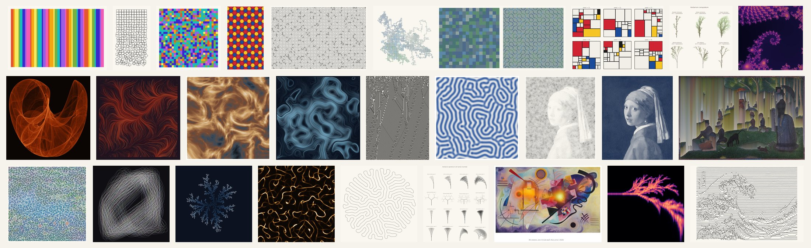

# Algorithmic Generative Art with Python

**For art historians learning mathematics and coding by reimplementation.**



:::{note}
This is the course book for <a href="https://ufind.univie.ac.at/en/course.html?lv=080120&amp;semester=2026W"><em>Algorithmic Generative Art with Python</em> (course 080120)</a> at the University of Vienna, taught in the winter semester 2026/27 in the Master's programme in Art History. It is a work in progress and will keep changing as the course runs; corrections, suggestions, and feedback of any kind are warmly welcome at <a href="mailto:xingyu.long@univie.ac.at">xingyu.long@univie.ac.at</a>.
:::

## Why rebuild what already exists

This text asks you to reimplement, from scratch, systems whose outputs already hang
in museums. That is a method, not a detour. Archaeologists learned long ago that some
knowledge only surfaces when you rebuild the thing: casting a bronze axe or raising a
megalith exposes decisions, constraints, and skills that no amount of looking at the
finished object can recover <a class="cite" href="#ref-coles1973">(Coles 1973)</a>,
a practice of testing what we think we know about how things were made, known
as *experimental archaeology* <a class="cite" href="#ref-outram2008">(Outram 2008)</a>.
Making as a mode of inquiry has the same standing closer to home: building a working
version of a concept is itself a way of thinking the concept through, what Ratto calls
*critical making* <a class="cite" href="#ref-ratto2011">(Ratto 2011)</a>. Media studies
has a neighbouring approach under the name *media archaeology*: the media of the past are
understood not from the standard histories alone, but by digging into the neglected
machines, formats, and practices themselves
<a class="cite" href="#ref-huhtamo2011">(Huhtamo and Parikka 2011)</a>. Early computer
art, drawn by plotters from code that often survives only in print, in fragments,
or not at all, is exactly such a site.

Recoding Georg Nees's *Schotter* or a Vera Molnár series works in much the same way. Every
parameter your version needs before it runs (how much disorder, which stopping rule,
what line weight) is a question the original artist once answered, and *reimplementation*
turns you from a viewer of the answer into a witness of the decision. The images this
text has you generate are side products in the best sense: what you are actually
building is an understanding of the systems behind them, precise enough to run.

One clarification, since the word *generative* has come to mean something else. These
notes do not use image models: no prompts, nothing downloaded that draws for you. Every
image here is produced by code you can read in full, usually a few dozen lines, and that
is the point. The objective is that you can read, write and understand the code and the
mathematics behind generative images; the images are the working material. No prior
programming or mathematics is assumed. Chapter 0 starts from zero.

## Computation is older than computers

Until the 1940s, *computer* was a job title. A computer was a person, very often a woman,
who carried out a written procedure step by step: tables of logarithms, the positions of
comets, the paths of shells, each entry produced by following instructions that somebody
else had written, without needing to know why they worked
<a class="cite" href="#ref-grier2005">(Grier 2005)</a>. When Alan Turing set out in 1936
to say precisely what it means to compute, he did not describe an electrical device. He
described that person, reduced to essentials: a strip of paper, a pencil, and a small table
of rules saying what to write and where to look next
<a class="cite" href="#ref-turing1937">(Turing 1937)</a>. Everything a laptop does still
fits inside that picture.

That is the first beautiful thing about computation, and the one these notes keep
returning to. A rule written precisely enough can be carried out by anyone, or anything,
and gives the same result every time. The rule is portable; the person who wrote it no
longer needs to be in the room. Artists noticed this long before there were machines to
exploit it. In 1704 the mathematician Sébastien Truchet looked at a floor tile, one square
split diagonally into two colours, and asked what repeated copies of it could make; his
memoir is a catalogue of patterns grown from a single tile and a rule for turning it
<a class="cite" href="#ref-truchet1704">(Truchet 1704)</a>, and chapter 4 rebuilds it.
In 1967 Sol LeWitt wrote that in conceptual art "the idea becomes a machine that makes
the art" <a class="cite" href="#ref-lewitt1967">(LeWitt 1967)</a>. To an artist the
sentence was a manifesto; to a programmer it is a plain description of a job: instructions
written by one person, executed by others. Chapter 1 begins there.

Every picture in the image at the top of this page was made that way. A Truchet field is
one tile and four ways to turn it. A fern is one letter, replaced by a short string, five
times over. The Mandelbrot set is "square it and add a constant", repeated, with each
point coloured by how quickly it runs away. A cellular automaton is a table of eight
cases. The rule fits on one line; the picture does not fit in your head. That gap,
between how little was written and how much came out, is the subject of these notes.

## When the image is a consequence of a rule

Three things follow once a picture is the output of a rule, and the course is built
around them.

*The same rule gives the same picture, forever.* Run it today or in ten years, on any
machine, and the image is identical to the pixel. That is rare in art and ordinary in
computation, and it is what makes a generative system something you can study rather
than only look at: change one thing, run it again, and you see exactly what that one
thing did.

*Every number is a decision.* Change one parameter and you get a neighbour of the
picture; sweep it and you get a family. Deciding which numbers exist at all, which dials
the system has and which it does not, is where the composition happens, and it is
exactly the decision that reimplementation makes visible.

*Chance is a number too.* Randomness enters a program only where the programmer lets it
in, and in the amount the programmer sets. The dice do not compose; the person who placed
them did. Chapter 2 is about placing them well.

So who made the picture: the person who wrote the rule, the machine that ran it, or the
one who chose the numbers? Chapter 1 opens the question and chapter 27 takes it up in
full. By the end of the course you will answer it with a system of your own on the
screen.

**References**

- <span id="ref-coles1973"></span>Coles, John M. *Archaeology by Experiment*. London: Hutchinson University Library, 1973.
- <span id="ref-grier2005"></span>Grier, David Alan. *When Computers Were Human*. Princeton: Princeton University Press, 2005.
- <span id="ref-huhtamo2011"></span>Huhtamo, Erkki, and Jussi Parikka, eds. *Media Archaeology: Approaches, Applications, and Implications*. Berkeley: University of California Press, 2011.
- <span id="ref-lewitt1967"></span>LeWitt, Sol. "Paragraphs on Conceptual Art." *Artforum* 5, no. 10 (1967), 79-83.
- <span id="ref-outram2008"></span>Outram, Alan K. "Introduction to Experimental Archaeology." *World Archaeology* 40, no. 1 (2008), 1-6. [doi:10.1080/00438240801889456](https://doi.org/10.1080/00438240801889456)
- <span id="ref-ratto2011"></span>Ratto, Matt. "Critical Making: Conceptual and Material Studies in Technology and Social Life." *The Information Society* 27, no. 4 (2011), 252-260. [doi:10.1080/01972243.2011.583819](https://doi.org/10.1080/01972243.2011.583819)
- <span id="ref-truchet1704"></span>Truchet, Sébastien. "Mémoire sur les combinaisons." *Mémoires de l'Académie Royale des Sciences* (1704), 363-372. [gallica.bnf.fr](https://gallica.bnf.fr/ark:/12148/bpt6k3486m)
- <span id="ref-turing1937"></span>Turing, Alan M. "On Computable Numbers, with an Application to the Entscheidungsproblem." *Proceedings of the London Mathematical Society* s2-42, no. 1 (1937), 230-265. [doi:10.1112/plms/s2-42.1.230](https://doi.org/10.1112/plms/s2-42.1.230)

## Chapters

### Prelude

| Ch. | Title | Core method | Art anchor |
|----:|-------|-------------|------------|
| 0 | [Warming Up: Python and Mathematics from Zero](notebooks/00-warming-up.ipynb) | Python basics, notation, first matplotlib | stripe painting: Stella, Davis, Riley, Buren |

### Part I · Foundations

| Ch. | Title | Core method | Art anchor |
|----:|-------|-------------|------------|
| 1 | [Random Walks: The First Generative System](notebooks/01-random-walks.ipynb) | loops, randomness, plotting | Sol LeWitt, Georg Nees *Schotter*, Vera Molnár |
| 2 | [Chance Operations and Controlled Randomness](notebooks/02-chance-and-randomness.ipynb) | distributions, seeding, weighted choice | Arp, Duchamp, Cage, Kelly, Richter |
| 3 | [Geometric Patterns and Symmetry](notebooks/03-geometric-patterns.ipynb) | trigonometry, rotation, tiling | Alhambra, girih tiles, Owen Jones, Escher |
| 4 | [Truchet Tiles: Chance on a Grid](notebooks/04-truchet-tiles.ipynb) | grid randomness, tile sets | Truchet 1704, Douat, Smith, *10 PRINT* |
| 5 | [Color: Spaces, Palettes, Extraction](notebooks/05-color.ipynb) | RGB/HSV/LAB, k-means | Itten, Albers, Rothko |

```{note}
Parts II to VI (chapters 6 to 27) are not online yet and will be published in the coming weeks; the tables below show what is coming.
```

### Part II · Growth and Iteration

| Ch. | Title | Core method | Art anchor |
|----:|-------|-------------|------------|
| 6 | Recursion and Subdivision | recursive functions | Mondrian, De Stijl |
| 7 | L-Systems and Botanical Form | string rewriting, turtle graphics | Merian, Besler, Haeckel, D'Arcy Thompson |
| 8 | Fractals: Infinite Detail | complex iteration, escape time | Mandelbrot, Hokusai, the Pollock controversy |
| 9 | Strange Attractors: The Shape of Chaos | iterated 2D maps, density rendering | Lorenz, Gleick, Pickover, de Jong |

### Part III · Fields and Grids

| Ch. | Title | Core method | Art anchor |
|----:|-------|-------------|------------|
| 10 | Noise and Flow Fields | coherent noise, vector fields | Perlin, Tyler Hobbs *Fidenza* |
| 11 | Deeper Noise: Cells, Ridges, and Warped Space | Worley noise, ridged fbm, domain warping | Ebru marbling, Worley, Musgrave, Quilez |
| 12 | Curl and the Endless Loop: Fields in Motion | curl noise, seamless loops | Bridson, phenakistiscope, the GIF |
| 13 | Cellular Automata and Emergence | rule tables, Game of Life | Jacquard loom, Anni Albers, Conway |
| 14 | Reaction-Diffusion: Turing Patterns | Gray-Scott model | Turing 1952, Morris, Jugendstil ornament |

### Part IV · The Image, Transformed

| Ch. | Title | Core method | Art anchor |
|----:|-------|-------------|------------|
| 15 | Voronoi, Delaunay, and Stippling | tessellation, Lloyd relaxation | Seurat, mosaic, Secord stippling |
| 16 | Filters, Edges, and Dithering | convolution, Gabor, Floyd-Steinberg | Lichtenstein, halftone, glitch |
| 17 | Pixel Sorting: The Aesthetics of the Glitch | sorting, masks, interval detection | Paik, Menkman, Asendorf |
| 18 | Circle Packing: The Portrait in Dots | collision tests, greedy growth | Kandinsky, Kusama, the Apollonian gasket |

### Part V · Agents and Complexity

| Ch. | Title | Core method | Art anchor |
|----:|-------|-------------|------------|
| 19 | Particles, Agents, and Flocking | Boids, simulation | Calder, Riley, teamLab, Reynolds 1987 |
| 20 | Aggregation: Growth by Random Walk | diffusion-limited aggregation | Bentley, Lichtenberg figures, Witten & Sander |
| 21 | Physarum: The Trail-Laying Swarm | agents coupled to a field | slime mold, Tero, Barnett, Jenson |
| 22 | Differential Growth: The Restless Line | neighbor forces, node insertion | Nervous System, Anders Hoff, kale and coral |
| 23 | Evolving Images: Breeding as Composition | mutation, selection by eye | Dawkins, Latham, Sims |

### Part VI · Coda

| Ch. | Title | Core method | Art anchor |
|----:|-------|-------------|------------|
| 24 | Attention Made Visible: Gaussians, KDE, Heatmaps | kernel density estimation | Yarbus, museum eye tracking |
| 25 | The Sounding Image: From Pixels to Sound | additive synthesis, spectrogram | Kandinsky, Fischinger, Xenakis |
| 26 | The Plotted Line: Vector Graphics and the Machine's Hand | SVG, line displacement, hatching | Molnár, Nake, the pulsar plot |
| 27 | Synthesis: Systems, Authorship, and the Final Project | combining techniques | Boden, Molnár's late fame, the NFT arc |

## How to use these notes

Every chapter is a fully executed notebook: all generated art is embedded,
and reading online requires no installation. To run and change the notebooks
yourself, which is the point of the course, set up your own copy once:

1. **Get the course folder.** Download it from the course's Moodle page and unpack it
   somewhere you will find again. Keep its structure as it is: the notebooks live in
   `notebooks/`, and they expect the `agap/` toolbox and the `assets/` folder next to them.
2. **Install Python.** Install [Miniforge](https://conda-forge.org/download/) (free, for
   Windows, macOS and Linux), then open a terminal (on Windows: the *Miniforge Prompt*
   from the Start menu), move into the course folder with `cd`, and run
   `conda env create -f environment.yml`. This creates an environment named `agap`
   with every library the notes use. If you already have a Python 3 installation you
   are happy with, `pip install -r requirements.txt` in the course folder does the
   same job.
3. **Start Jupyter.** In the terminal, inside the course folder, run
   `conda activate agap` and then `jupyter lab`. A browser tab opens; use its file
   list to open `notebooks/00-warming-up.ipynb`. Chapter 0 explains the rest, starting
   with how to run a cell.
4. **Fetch the paintings (once, with internet).** Chapters 5 and later work on
   public-domain reproductions of four paintings that are not included in the folder:
   `python assets/images/get_images.py` downloads them from Wikimedia Commons.

Before the first session, please get as far as running the first code cell of
chapter 0; the session will not wait for installations. If something refuses to work,
bring the error message: it is usually a one-line fix.

Each chapter opens with a Context section on the artists and ideas behind its
technique and closes with further reading and references; these are reference
material, meant for reading the way you would read the wall texts of an exhibition.
The working core of a chapter (the mathematics, the code, the images, the exercises)
is sized for roughly one 90-minute session.

## How to cite

If you use these notes in your research or teaching, please cite them as:

> Long, Xingyu. *Algorithmic Generative Art with Python.* Lecture notes,
> University of Vienna, 2026. https://xyslong.github.io/agap/

```bibtex
@misc{long2026agap,
  author = {Long, Xingyu},
  title  = {Algorithmic Generative Art with Python},
  year   = {2026},
  url    = {https://xyslong.github.io/agap/}
}
```

---

Code is licensed under the [MIT License](https://opensource.org/license/mit), text under
[CC BY 4.0](https://creativecommons.org/licenses/by/4.0/). Quotations from other authors,
reproductions of artworks, and the eye-tracking data in `assets/data/` are excluded from
these licenses; the underlying dataset is published separately on
[Zenodo](https://doi.org/10.5281/zenodo.21983283) under CC BY 4.0.

Painting reproductions: Claude Monet, *Water Lilies* (1906), Art Institute of Chicago;
Georges Seurat, *A Sunday on La Grande Jatte* (1884-86), Art Institute of Chicago;
Johannes Vermeer, *Girl with a Pearl Earring* (c. 1665), Mauritshuis, The Hague;
Katsushika Hokusai, *The Great Wave off Kanagawa* (c. 1830-32), Metropolitan Museum of Art;
Wassily Kandinsky, *Yellow-Red-Blue* (1925), Centre Pompidou, Paris. All five works are in
the public domain; reproductions via Wikimedia Commons.
